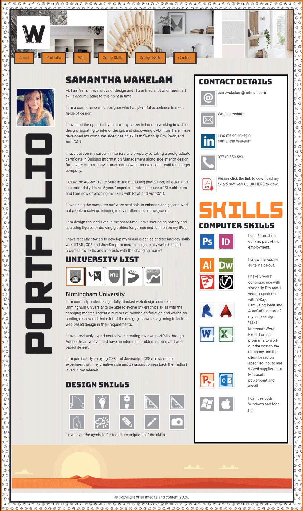
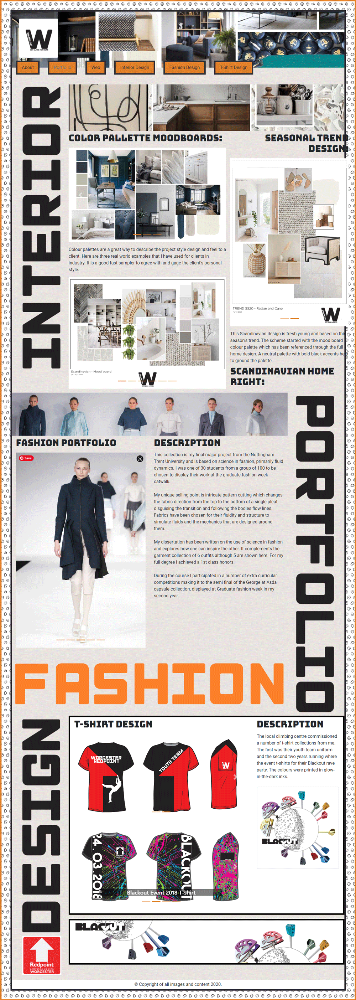
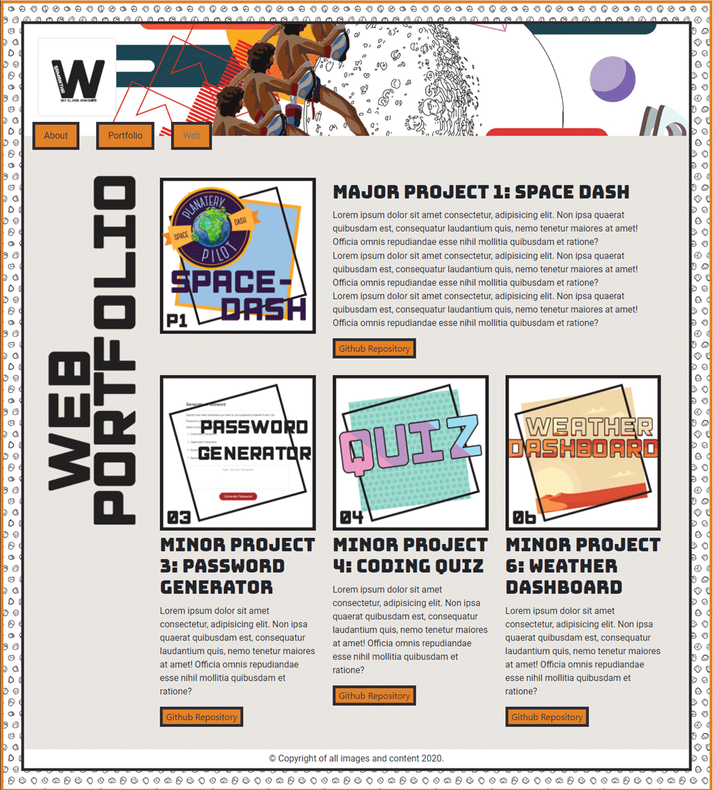
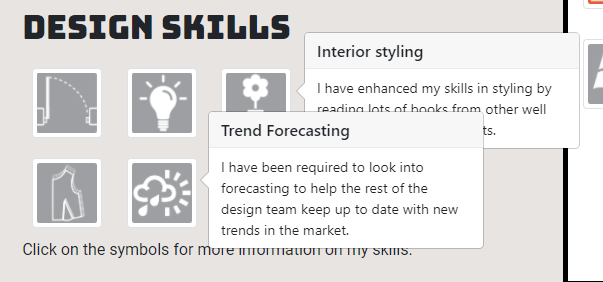
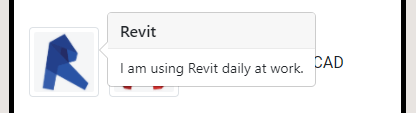
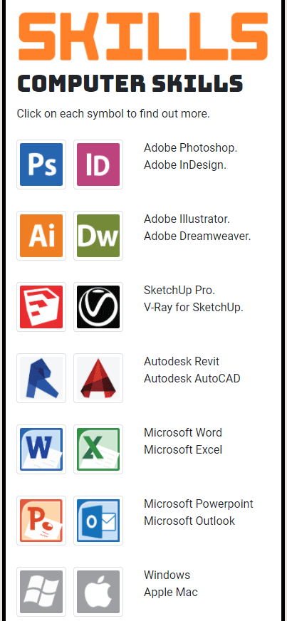

# Portfolio Online 

This is my online profile, portfolio, and cv. It is a great way to showcase my skills and portfolio for prospective employers not only for my web development skills but also my design portfolio. 
This is an update to the previous portfolio project which was meant to test our skills with using CSS frameworks; this is a showcase of the skills I have learnt over the last 8 weeks of the Full stacked Coding bootcamp run by the University of Birmingham. 
The Problem this solves for me is having my portfolio all in one place in an easily spendable format as visual content is often too large for emails to send everything you wish to. It is also a great way for people to find you and see what you are capable with contact options should they believe you would be a good fit for their requirements. 

I have been able to cement fundamental theories in HTML and CSS. One final showcase in the front end before diving into the back end of web coding. 
Hopefully, my portfolio stands out not just because of my coding skills but because I have the ability to design as well. I have training in design, graphics and layout and the tools to help me basically create anything I want to display. 
Aside from design, I have had a lot of fun with the media queries and Bootstrap’s responsive settings making the layout restack and reorder as the screen shrinks. Hopefully, this will stand out as a great responsive portfolio. 

## Contents 

1. [Installation](#installation)
2. [Usage](#useage)
3. [Improvements](#index)
4. [Updates](#updates)
5. [Credits](#credits)
6. [License](#license)

## Installation

The best way to view my portfolio is [here](https://samwakelam.github.io/08_RESPONSIVE-PORTFOLIO_SLW/) using github pages. for behind the scenes you can see the repo [here](https://github.com/Samwakelam/08_RESPONSIVE-PORTFOLIO_SLW). 

Technologies I have used:
* HTML 
* CSS
* Bootstrap
* Popper

## Usage

### Index / Homepage

Here you can view my "brand statment", see how to get in touch, view my university and educational history, and all my skills. 

Click on the Badges to view more information. 

Download my CV in PDF or view it in an onscreen modal carousel. 

### Portfolio Page

Here you can see my design history. The images are all on interval carousels. 

### Web Page

Click each large tile to be taken to another tab showcasing each project, or alternitivley you can go to github to see each projects readme and code for usage, screenshots and to see how i have acheived each project. 

## Improvements

### From Previous 02_Portfolio

Improvements that i would like to highlight from my last porfolio are: 

1. The use of popovers rather than tooltips to better present text and additional information with the skills badges. 

2. Better placement of the design skills section 

3. The text is better presented in the skills aside bar due to the popovers here. 

### Future Improvements

the popovers show over each other and have to be clicked again to remove. There could be a way (probably javascript) to remove the first when another is clicked. 

## Updates

(28.01.2021) 
- Popovers are now dissabled when focus is no longer on the item. 
- University badges stack better for mobile response. 
- Github profile link added to contacts 
- Computer skills stack better for mobile response. 
- Projects updated with Major Project 2 and best selection of deployed weekly projects. 

## Credits

Thanks go to Ben Ashley for helping me sort out the popper and CDN. 

## License

All graphics have been created by myself including alot of the symbols used. Please donot copy or resue any of the graphics on these pages without the express permision of the owner (Me). 

All fashion and interior design is also copyright to myself and not to be coppied or recreated without my permision. 